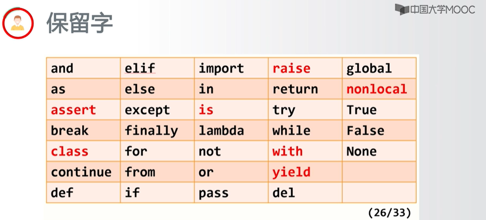

# 基本语法元素分析

 

## 字符串

存在逆向索引,切片，最后一位是 -1  
如 tempstr[0:-1] 指 从0开始去掉最后一个字符

判断是否存在某字符：  
tempstr[-1] in ["C","c"] ,结果返回布尔类型  

## if else写法

if xxxxxx :

elif:

else:

## 函数

## 输入输出

x = input("请输入")  
print("输入格式错误")  
print("转换后的温度是{:.2f}C".forma(temp))  
如果 变量temp 值为123.456789，则输出，123.45C  

## eval评估函数(任何字符串信息变为python语句)
将字符串最外侧引号去掉，如:  
eval("1+2")  
输出 3  
eval("'1+2'")  
输出 '1+2'
eval('print("Hello")')  
输出 Hello