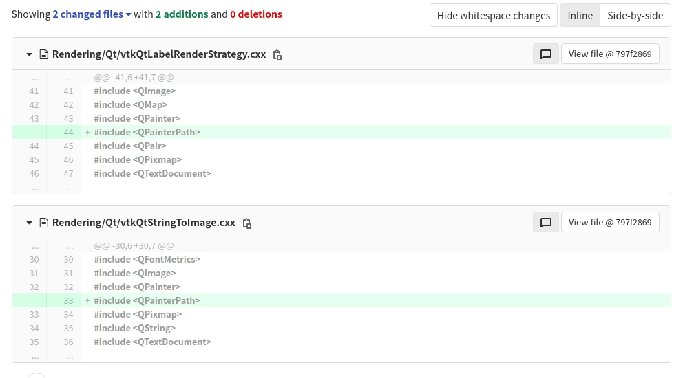

# 项目环境配置

## JetSon TX2

### JetPack 4.4(CUDA 10.2 TensorRT 加速)

### OpenCV4.4.0 with contrib

### VNC Server

### Zed SDK

## 调试Zed2用PC

### OpenCV-4.4.0 with contrib

1. 提前下载 IPP_ICV,Face_Landmark_model.dat，boostdesc，vgg等文件到本地，修改Cmake过程中获取文件路径，提高编译速度
2. cmake过程勾选，dnn，cuda，nonfree等选项。详细见教程[TX2 Install OpenCV(4.0.0)](https://blog.csdn.net/u012254599/article/details/95938704)

### Zed_SDK

从官方下载对应.run文件即可，chmod a+x修改权限后即可直接安装

### Qt-5.15.1

Qt-5.15.0版本环境，编译VTK9.0.1不会出错，编译 VTK 8.2.0会报 QPaintPath错误
Qt环境变量配置可参考[参考网页](https://www.it610.com/article/1294454736984023040.htm)

~~~Qt环境变量
export PATH=$PATH:"/usr/local/cuda-10.2/bin":"/home/shawntao/Qt/5.15.1/gcc_64/bin":"/home/shawntao/Qt/Tools/QtCreator/bin":"/home/shawntao/anaconda3/bin"
export QT_PLUGIN_PATH=$QT_PLUGIN_PATH:"/home/shawntao/Qt/5.15.1/gcc_64/plugins"
export QML2_IMPORT_PATH=$QML2_IMPORT_PATH:"/home/shawntao/Qt/5.15.1/gcc_64/qml"
export LD_LIBRARY_PATH=$LD_LIBRARY_PATH:"/usr/local/cuda-10.2/lib64":"/home/shawntao/Qt/5.15.1/gcc_64/lib"
export CUDA_HOME=$CUDA_HOME:"/usr/local/cuda-10.2"
export PKG_CONFIG_PATH=$PKG_CONFIG_PATH:"/usr/local/lib/pkgconfig"
export QTCREATOR_HOME="/home/shawntao/Qt/Tools/QtCreator/bin"
~~~

### VTK

#### VTK-9.0.1

[可参考教程](https://www.jianshu.com/p/859a3dae27d4)

1. 编译前，删除Ubuntu自带Qt4，Qt5，尤其记得清理 '/usr/lib/x86_64-linux-gnu/cmake'
2. 在~/.bashrc文件中，添加Qt5.15.0，环境变量，如上，其中包含anaconda与cuda环境变量，酌情选择。
3. 建议使用cmake-gui，configure过程，注意添加qt支持，第二次点击configure后，会出现Qt路径，核实后进行generate，注意type选择 release。
4. make 完成后 拷贝和Qt相关的.so库

#### VTK-8.2.0

VTK9.0.1环境，编译PCL-1.11.1会报错，所以选用8.2.0版本，编译过程大致与9.0.1一致  
Qt 5.15.0版本之后，QPrint库有调整，需要修改源代码，否则会导致make过程报错，9.0.1版本已经修复此bug修改方式为  

### PCL 1.11.1

可以参考[参考博客](https://blog.csdn.net/u014301278/article/details/102947451)
